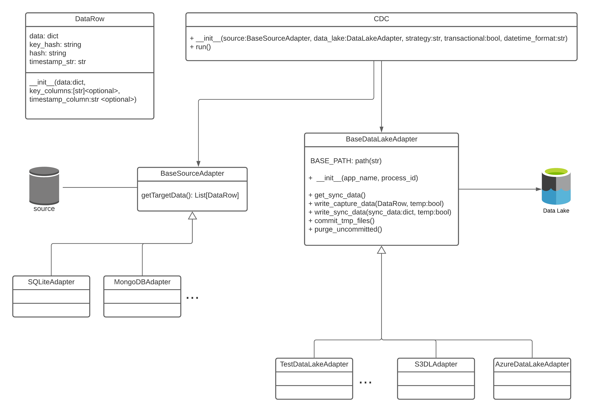

# CDC assignment
Build the architecture for an incremental batch job able to capture data changes (diff&where) and move data from a source to a 
data lake destination.

## Architecture

(not strict UML)

The diff&where CDC logic is fixed: for registry data we need to compare hashes (which are always strings) while 
for log data we need to compare timestamps (which can be represented consistently no matter the source.

The actual data cdc is monitoring isn't really needed by the cdc (it's just used to generate hash/khash): no matter
the structure of this target data, it can be treated as a dictionary.

The `DataRow` class is defined. It is a concrete class used to represent the target data (as a dictionary) and 
the hash/khash or timestamp (depending on what is needed).

By delegating the creation of `DataRow` to the developer, the cdc implementation is standard and doesn't need to be 
modified for the specific case. The developer only has to define **how to retrieve the data**(1) to observe,
**how to access the DataLake destination**(2) and (in case of log strategy) how to parse the str timestamp
into a datetime object(3).
 
1. A concrete `SourceAdapter` must be implemented. This object will handle the connection to the source;
the inherited method `get_target_data` has to return a list of `DataRow`.
 
2. A concrete `DataLakeAdapter` must be implemented. The required behaviour is defined by the superclass but
it has to be redefined to work with the specific data lake solution.

3. Pass a valid datetime format to the `CDC` constructor.

### Log data vs Registry data

When building the `CDC` object, the parameter `strategy` can be set to 'log' or 'registry': this parameter will tell
the `CDC.run()` method which logic to use. The choice of the strategy has to be
consistent whit the implementation of `SourceAdapter`, meaning that `get_target_data` has to build `DataRow` objects by
passing 
+ a set of "keys" and a set of "data_keys" if the strategy is `registry`;
+ the "timestamp key" if the strategy is `log`.

**Important:** If `log` strategy is used, the timestamp value in the `DataRow` dictionary must be convertible
into a `datetime` object (using the format specified during `CDC __init__`).

### Transactionality

**Move and Rename** is supported:

1. Set `transactional=True` in the `CDC` constructor
2. Implement the DataLakeAdapter accordingly. A `temp` boolean parameter is passed to the methods writing in the data lake.

## Extensions

+ Timestamp could also easily be added to registry cdc (one line in the `DataRow` constructor)
+ DataLakeAdapter can serialize and save files in the format of choice
+ A standard SQL SourceAdapter could work with most sql engines (?)

## Constraints/Assumptions/Considerations

+ every timestamp can be represented by a datetime object
+ `CDC` expects the loaded sync data to be represented as a dictionary in this format:
    
    log strategy
    `{"timestamp": "2020-11-14 08:43:57"}`
    
    registry strategy
    `{
      khash: hash,
      khash: hash,
      khash: hash,
      ...
     }`
    
    
+ `DataRow` calculates hash/khash in the `__init__`. The way I implemented it is inefficient and probably the hash calculation
could be delegated to the `SourceAdapter`. The main problem is that the data dictionary could be nested 
(schema-less source for example).
+ The transactional behaviour has to be implemented by the `DataLakeAdapter`
+ `SourceAdapter.get_target_data()` could be problematic if the loaded data is huge. It could load
data in chunks and yield them.

probably many more problems...